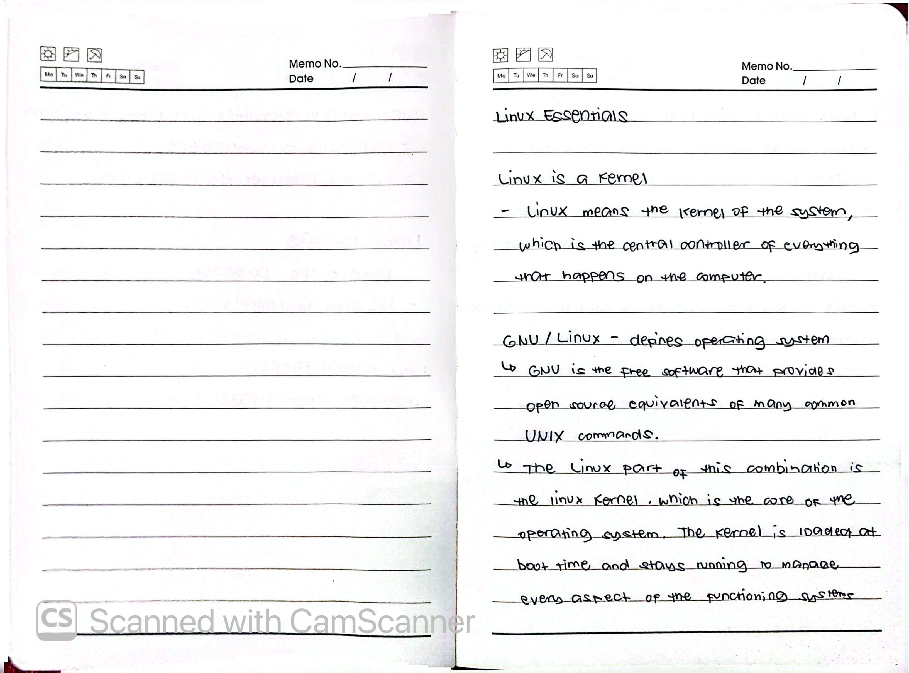
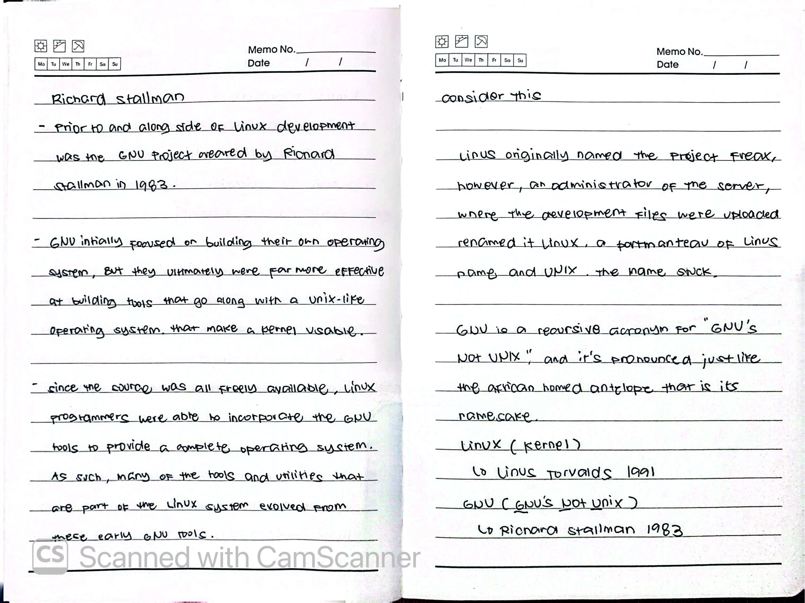
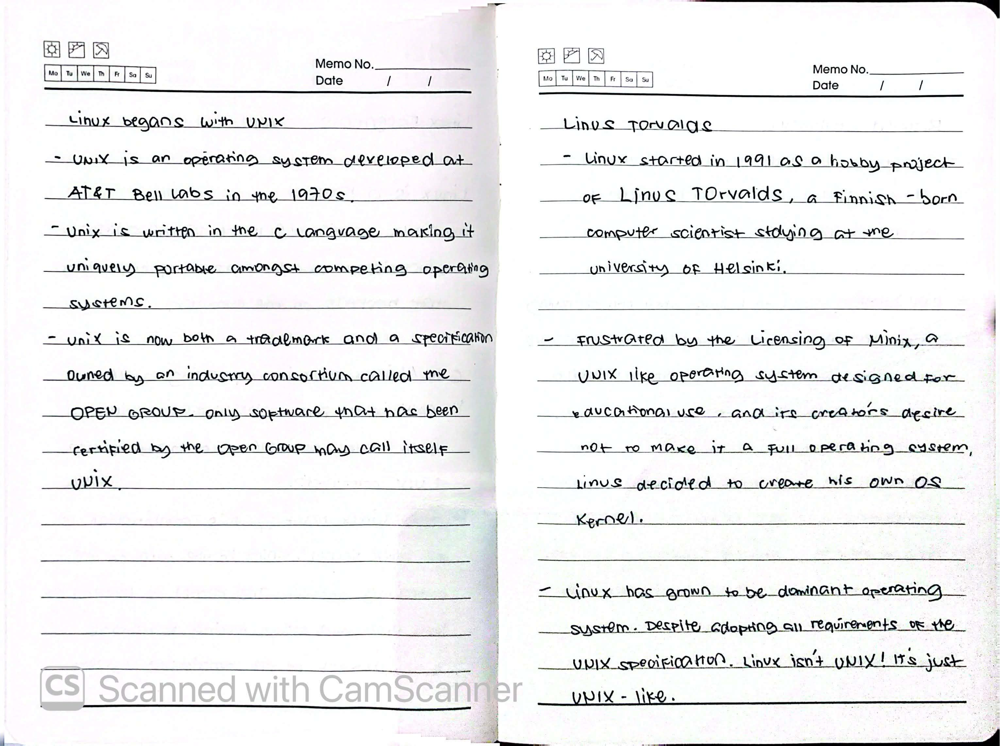
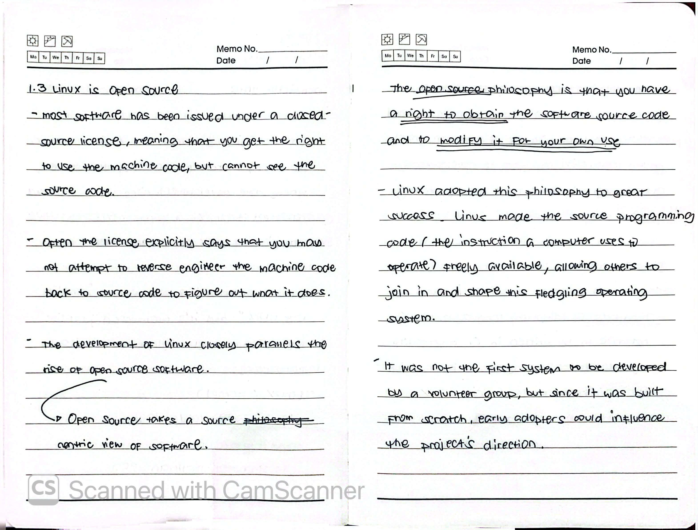
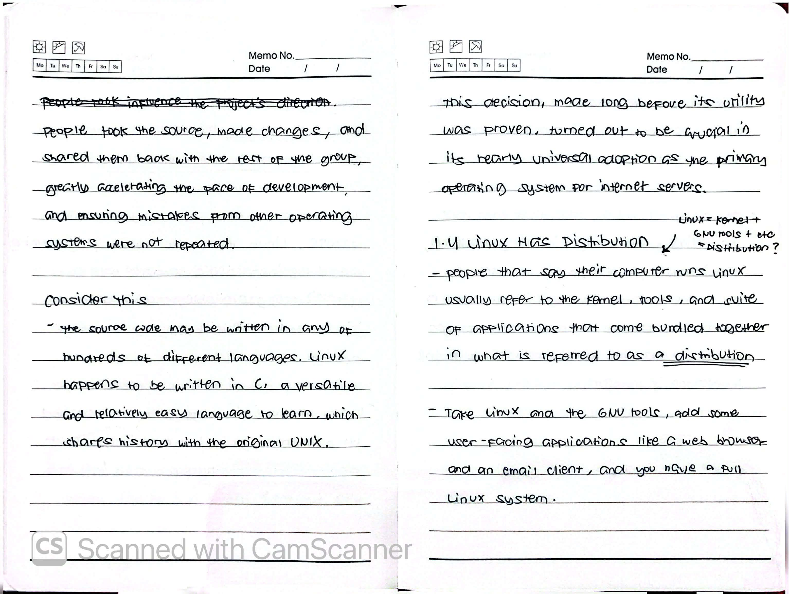
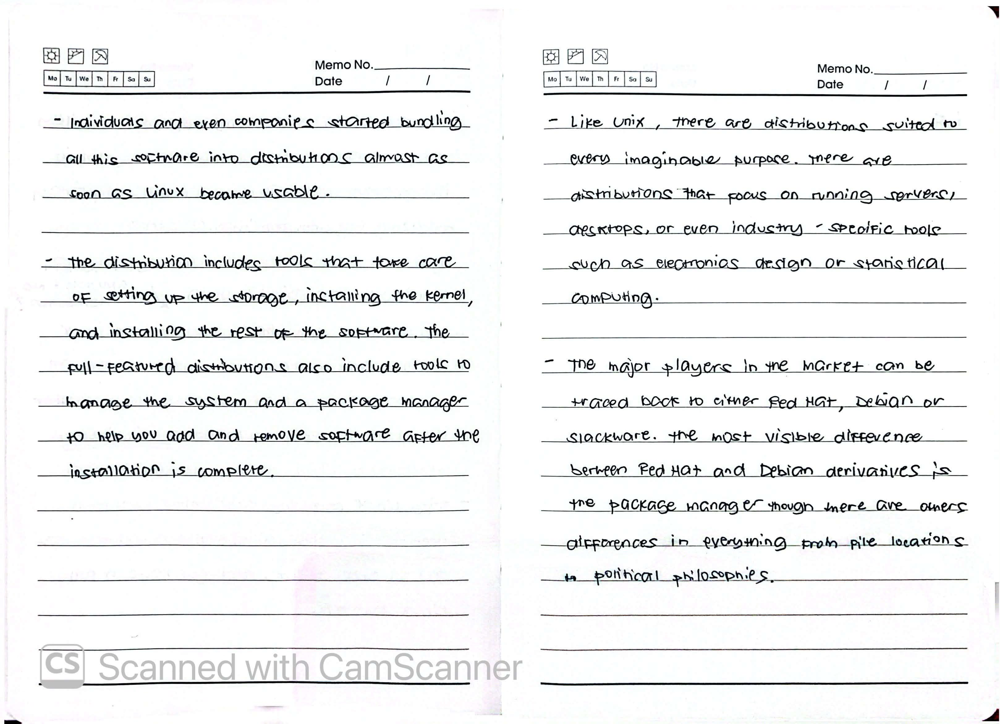
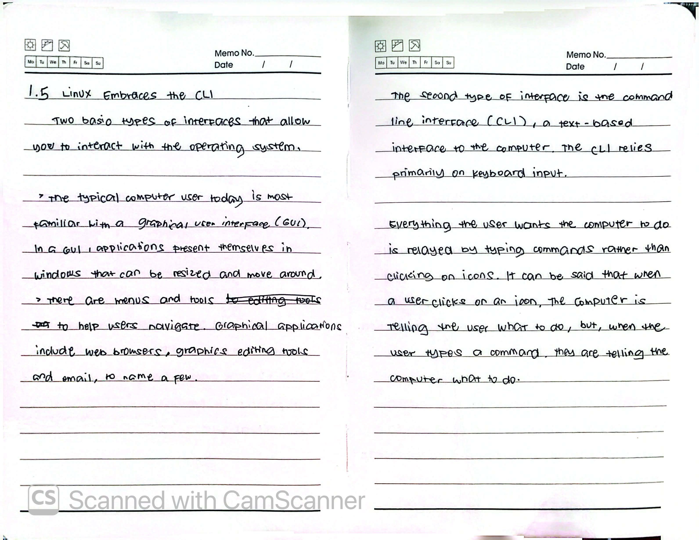
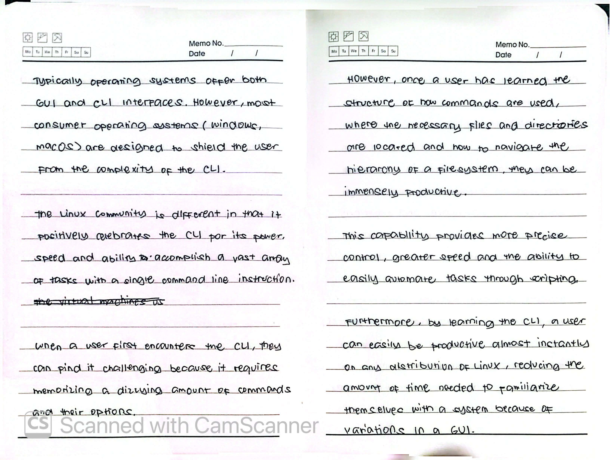

# Module 01: Introduction to Linux

> **Course:** NDG Linux Essentials  
> **Status:** ✅ Complete  
> **Objective:** Understand the history, architecture, and core components of the Linux operating system.

---

## 📖 Chapter 1: Introduction to Linux

### Linux Essentials

#### Linux is a Kernel
- Linux means the kernel of the system, which is the central controller of everything that happens on the computer.
- GNU / Linux - defines operating system
  - GNU is the free software that provides open source equivalents of many common UNIX commands.
  - The Linux part of this combination is the Linux kernel, which is the core of the operating system. The kernel is loaded at boot time and stays running to manage every aspect of the functioning system.

#### Richard Stallman
- Prior to and alongside of Linux development was the GNU project created by Richard Stallman in 1963.
- GNU initially focused on building their own operating system, but they ultimately were far more effective at building tools that go along with a Unix-like operating system that make a kernel usable.
- Since the source was all freely available, Linux programmers were able to incorporate the GNU tools to provide a complete operating system. As such, many of the tools and utilities that are part of the Linux system evolved from these early GNU tools.

> **Consider this**
> Linus originally named the project Freax, however, an administrator of the server, where the development files were uploaded renamed it Linux, a portmanteau of Linus name and UNIX. the name stuck.

- GNU is a recursive acronym for "GNU's Not UNIX", and it's pronounced just like the african horned antelope that is its namesake.
- **Linux (kernel)**
  - Linus Torvalds 1991
- **GNU (GNU's Not Unix)**
  - Richard Stallman 1983

#### Linux begins with UNIX
- UNIX is an operating system developed at AT&T Bell Labs in the 1970s.
- UNIX is written in the C language making it uniquely portable amongst competing operating systems.
- UNIX is now both a trademark and a specification owned by an industry consortium called the Open Group. Only software that has been certified by the Open Group may call itself UNIX.

#### Linus Torvalds
- Linux started in 1991 as a hobby project of Linus Torvalds, a Finnish-born computer scientist staying at the University of Helsinki.
- Frustrated by the licensing of Minix, a UNIX-like operating system designed for educational use, and its creator's desire not to make it a full operating system, Linus decided to create his own OS kernel.
- Linux has grown to be dominant operating system. Despite adopting all requirements of the UNIX specification, Linux isn't UNIX! It's just UNIX-like.

#### 1.3 Linux is Open Source
- Most software has been issued under a closed-source license, meaning that you get the right to use the machine code, but cannot see the source code.
- Often the license explicitly says that you may not attempt to reverse engineer the machine code back to source code to figure out what it does.
- The development of Linux closely parallels the rise of open source software.
  - Open source takes a source centric view of software.
- the open source philosophy is that you have a right to obtain the software source code and to modify it for your own use.
- Linux adopted this philosophy to great success. Linux made the source programming code (the instruction a computer uses to operate) freely available, allowing others to join in and shape this fledgling operating system.
- It was not the first system to be developed by a volunteer group, but since it was built from scratch, early adopters could influence the project's direction.
- People took the source, made changes, and shared them back with the rest of the group, greatly accelerating the pace of development, and ensuring mistakes from other operating systems were not repeated.

> **Consider this**
> the source code may be written in any of hundreds of different languages. Linux happens to be written in C, a versatile and relatively easy language to learn, which shares history with the original UNIX.

- This decision, made long before its utility was proven, turned out to be crucial in its nearly universal adoption as the primary operating system for internet servers.

#### 1.4 Linux Has Distributions
- Linux = kernel + GNU tools + etc = distribution?
- People that say their computer runs Linux usually refer to the kernel, tools, and suite of applications that come bundled together in what is referred to as a distribution.
- Take Linux and the GNU tools, add some user-facing applications like a web browser and an email client, and you have a full Linux system.
- Individuals and even companies started bundling all this software into distributions almost as soon as Linux became usable.
- The distribution includes tools that take care of setting up the storage, installing the kernel, and installing the rest of the software. The full-featured distributions also include tools to manage the system and a package manager to help you add and remove software after the installation is complete.
- Like Unix, there are distributions suited to every imaginable purpose. There are distributions that focus on running servers, desktops, or even industry-specific tools such as electronics design or statistical computing.
- The major players in the market can be traced back to either Red Hat, Debian or Slackware. The most visible difference between Red Hat and Debian derivatives is the package manager though there are other differences in everything from file locations to political philosophies.

#### 1.5 Linux Embraces the CLI
- Two basic types of interfaces that allow you to interact with the operating system.
  - the typical computer user today is most familiar with a Graphical User Interface (GUI). In a GUI, applications present themselves in windows that can be resized and moved around.
  - there are menus and tools (editing tools) to help users navigate. Graphical applications include web browsers, graphics editing tools and email, to name a few.
- The second type of interface is the command line interface (CLI), a text-based interface to the computer. the CLI relies primarily on keyboard input.
- Everything the user wants the computer to do is relayed by typing commands rather than clicking on icons. It can be said that when a user clicks on an icon, the computer is telling the user what to do, but, when the user types a command, they are telling the computer what to do.
- Typically operating systems offer both GUI and CLI interfaces. However, most consumer operating systems (Windows, macOS) are designed to shield the user from the complexity of the CLI.
- The Linux community is different in that it positively celebrates the CLI for its power, speed and ability to accomplish a vast array of tasks with a single command line instruction.
- When a user first encounters the CLI, they can find it challenging because it requires memorizing a dizzying amount of commands and their options.
- However, once a user has learned the structure of how commands are used, where the necessary files and directories are located and how to navigate the hierarchy of a filesystem, they can be immensely productive.
- This capability provides more precise control, greater speed and the ability to easily automate tasks through scripting.
- Furthermore, by learning the CLI, a user can easily be productive almost instantly on any distribution of Linux, reducing the amount of time needed to familiarize themselves with a system because of variations in a GUI.

---

## 📸 Proof of Learning (Handwritten Notes)

### Image 1: Linux is a Kernel & GNU/Linux

### Image 2: Richard Stallman & The GNU Project

### Image 3: UNIX History & Linus Torvalds

### Image 4: Linux is Open Source

### Image 5: Open Source Philosophy & Linux Distributions

### Image 6: Linux Distributions & Package Managers

### Image 7: Linux Embraces the CLI (Part 1)

### Image 8: Linux Embraces the CLI (Part 2)

---

## 🆕 Ongoing Learning & Additions

### New Discoveries / Lab Reflections

### Command Cheat Sheet (Module 01)
| Command | Description | Example |
| :--- | :--- | :--- |
| `uname -r` | Show Linux kernel version | `uname -r` |
| `su` | Switch user (to root) | `su` |
| `ls` | List directory contents | `ls -la` |

---

## 📚 Resources
- [LPI Linux Essentials Official Page](https://www.lpi.org/our-certifications/linux-essentials-overview/)
- [GNU Project Official Website](https://www.gnu.org/)
- [The Linux Kernel Archives](https://www.kernel.org/)