# Module 02: Operating Systems

> **Course:** NDG Linux Essentials  
> **Status:** 🔄 In Progress  
> **Objective:** Understand the role of operating systems, different interface types, and major OS families.

---

## 📖 Chapter 2: Operating Systems

### 2.1 Operating Systems
- an operating system is software that runs on a computing device and manages the hardware and software components that make up a functional computing system.
- Modern operating systems don't just manage hardware and software resources, they schedule programs to run in a multi-tasking manner (sharing the processor so that multiple tasks can occur apparently simultaneously)
- provide standard services that allow users and programs to request something happen (for example a print job) from the operating system, and provided it's properly requested, the operating system will accept the request and perform the function needed.
- Desktop and server operating systems are by nature more complex than an operating system that runs on a single-purpose device such as a firewall, or a mobile phone. From a simple set-top box that provides a menu interface for a cable provider, to supercomputers and massive, parallel computing clusters, the generic term operating system is used to describe whatever software is booted and run on that device.

> **Diagram:**
> users
> software (system software, application, operating system)
> hardware

- Computer users today have a choice mainly between three major operating systems: Microsoft Windows, Apple MacOS, and Linux.
- Of the three major operating systems listed, only Microsoft windows is unique in its underlying code. Apple's MacOS is a fully-qualified UNIX distribution based on BSD Unix (an operating system distributed until 1995), complemented by a large amount of proprietary code. It runs on hardware specifically optimized to work with Apple software.
- Linux can be any one of hundreds of distribution packages designed or optimized for whatever task is required. Only Microsoft windows is based on a proprietary code base that isn't either UNIX or Linux based.
- A user can easily interact with any of these systems by pointing and clicking their way through everyday productivity tasks that all behave similarly regardless of the underlying operating system.
- Except for windows, which is mostly administered via the GUI, most system administration tasks are performed using typed commands in a terminal.
- An administrator that is familiar with UNIX can typically perform tasks on Linux system and vise versa. Many UNIX command line functions also have Microsoft equivalents that administrator use to do their work efficiently.

### 2.1.1 Decision Points

#### Role
- The first decision when specifying any computer system is the machine's role.
  - Will you be sitting at the console running productivity applications or web browsing? If so, a familiar desktop is best.
  - Will the machine be accessed remotely by many users or provide services to remote users? Then it's a server.
- Servers typically sit in a rack and share a keyboard and monitor with many other computers, since console access is generally only used for configuration and troubleshooting.
- servers generally run as a CLI, which frees up resources for the real purpose of the computer: serving information to clients (any user or system that accesses resources remotely).
- Desktop systems primarily run a GUI for the ease of use of their users.

#### Function
- Next point is to determine the functions of the machine. Is there a specific software it needs to run, or specific functions it needs to perform? Will there be hundreds, even thousands, of these machines running at the same time? What is the skill-set of the team managing the computer and software?

#### life cycle
- the service lifetime and risk tolerance of the server also needs to be determined. Operating systems and software upgrades come on a periodic basis, called a release cycle.
- vendors only support older version of software for a certain period of time before not offering any updates; this is called a maintenance cycle or life cycle.
- In an enterprise server environment, maintenance and release cycles are critical considerations because it is time-consuming and expensive to do major upgrades. Instead, the server hardware itself is often replaced because increased performance is worth extra expense and the resources involved are often many times more costly than the hardware.

> **consider this**
> there is a fair amount of work involved in upgrading a server due to specialized configurations, application software patching, and user testing, so a proactive organization will seek to maximize their return on investment in both human and monetary capital.

- Modern data centers are addressing this challenge through virtualization. In a virtual environment, one physical machine can host dozens, or even hundreds of virtual machines, decreasing space and power requirements, as well as providing for automation of many tasks previously done manually by systems administrators.
- scripting programs allow virtual machines to be created, configured, deployed and removed from a network without the need for human intervention. Of course, a human still needs to write the script and monitor these systems, at least for now.
- the need for physical hardware upgrades has also been decreased immensely with the advent of cloud services providers like AMAZON WEB SERVICES, RACKSPACE, and MICROSOFT AZURE.
- Similar advances have helped desktop administrators manage upgrades in an automatic fashion and with little to no user interruption.

#### Stability
- individual software releases can be characterized as beta or stable depending on where they are in the release cycle. when a software release has many new features that haven't been tested, it's typically referred to as beta. After being tested in the field, it's designation changes to stable.
- users who need the latest features can decide to use beta software. This is often done in the development phase of a new development and provides the ability to request features not available on the stable release.
- production servers typically use stable software unless needed features are not available, and the risk of running code that has not been thoroughly tested is outweighed by the utility provided.
- software in the open source realm is often released for peer review very early on in its development process, and can very quickly be put into testing and even production environments, providing extremely useful feedback and code submissions to fix issues found or features needed.
- Conversely, proprietary software will often be kept secret for most of its development, only reaching a public beta test when it's almost ready for release.

#### Compatibility
- Another loosely-related concept is backward compatibility which refers to the ability of later operating systems to be compatible with software made for earlier versions. This is usually a concern when its necessary to upgrade an operating system, but an application software upgrade is not possible due to cost or lack of availability.
- The norm for open source software development is to ensure backward compatibility first and break things only as a last resort. the common practice of maintaining and versioning libraries of functions helps this greatly.
- Typically, a library that is used by one or more programs is versioned as a new release when significant changes have occurred but also keeps all the functions (and compatibility) of earlier versions that may be hard-coded or referred by existing software.

#### Cost
- cost is always a factor when specifying new systems. Microsoft has annual licensing fees that apply to users, servers and other software, as do many other software companies. Ultimately, the choice of operating system will be affected by available hardware, staff resources and skill, cost of purchase, maintenance, and projected future requirements.
- virtualization and outsourced support services offer the modern IT organization the promise of having to pay for only what it uses rather than building in excess capacity. This not only control costs but offer opportunities for people both inside and outside the organization to provide expertise and values.

#### Interface
- The first electronic computer systems were controlled by means of switches and plugboards similar to those used by telephone operators at the time. then came punch cards and finally a text-based terminal system similar to the Linux command line interface (CLI) in use today.
- The graphical user interface (GUI), with a mouse and buttons to click, was pioneered at Xerox PARC (Palo Alto Research Center) in the early 1970s and popularized by Apple computer in the 1980s.
- Today, operating systems offer both GUI and CLI interfaces, however, most consumer operating systems (window, MacOS) are designed to shield the user from the ins and outs of the CLI.

### 2.2 Microsoft Windows
- Microsoft offers different versions of its operating system according to the machine's role: desktop or server?
- The desktop version of windows has undergone various naming schemes with the current version (as of this writing) being simply windows 11.
- While new versions of most Linux distributions comeout twice a year, around March and September, new versions of windows tend to be released only every few years.
- In all, there have been 16 versions of windows since 1985. backward compatibility is a priority for Microsoft, even going far as to bundle virtual machine technology so that users can run older software.
- windows server currently (as of this writing) is at version 2019 to denote the release date. the server can run GUI but recently microsoft, largely as a competitive response to linux, has made incredible strides in its command line scripting capabilities through Powershell and Windows Subsystem for Linux (WSL). there is also an optional Desktop Experience package which mimics a standard productivity machine. Microsoft also actively encourages enterprise customers to incorporate its Azure cloud service.

### 2.3 Apple MacOS
- Apple makes the macOS operating system, which is partially based on software from the FreeBSD project and has undergone UNIX certification.
- macOS is well known for being "easy to use", and such has continued to be favored by users with limited access to IT resources like schools and small businesses. It is also very popular with programmers due to its robust UNIX underpinnings.
- On the server side, macOS server is primarily aimed at smaller organizations. This low-cost addition to macOS desktop allows users to collaborate, and administrators to control access to shared resources. It also provides integration with iOS devices like the iPhone and iPod.
- Some large corporate IT departments allow users to choose macOS since users often require less support than standard Microsoft productivity deployments. The continued popularity of macOS has ensured healthy support from software vendors. macOS is also quite popular in the creative industries such as graphics and video production.
- For many of these users, application choice drives the operating system decision. Apple hardware, being integrated so closely with the operating system, and their insistence on adherence to standards in application programming gives these creative professionals a stable platform to perform many computing intense functions with fewer concerns about compatibility.

### 2.4 Linux
- Linux users typically obtain an operating system by downloading a distribution. A Linux distribution is a bundle of software, typically comprised of the Linux kernel, utilities, management tools, and even some application software in a package which also includes the means to update core software and install additional applications.
- The distribution takes care of setting up the storage, building the kernel and installing hardware drivers, as well as installing applications and utilities to make a fully functional computer system.
- The organizations that create distributions also include tools to manage the system, a package manager to add and remove software, as well as update programs to provide security and functionality patches.
- The number of Linux distributions available numbers in the hundreds, so the choice can seem daunting at first. However, the decision points are mostly the same as those highlighted for choosing an operating system.

#### Role
- With Linux, there are multiple options to choose from depending on organizational needs. The variety of systems distributions and accompanying software allows the operating system to be significantly more flexible and customizable.
- Distributions are available for a much wider variety of systems, from commercial offerings for the traditional server or desktop roles, to specialized distributions designed to turn an old computer into a network firewall, from distributions created to power a supercomputer, to those that enable embedded systems.
- These might focus on running application or web servers, productivity desktops, point-of-sale systems, or even tools dedicated to electronics design or statistical computing.

---

## 📸 Proof of Learning (Handwritten Notes)

### Image 1: Operating Systems (Part 1)
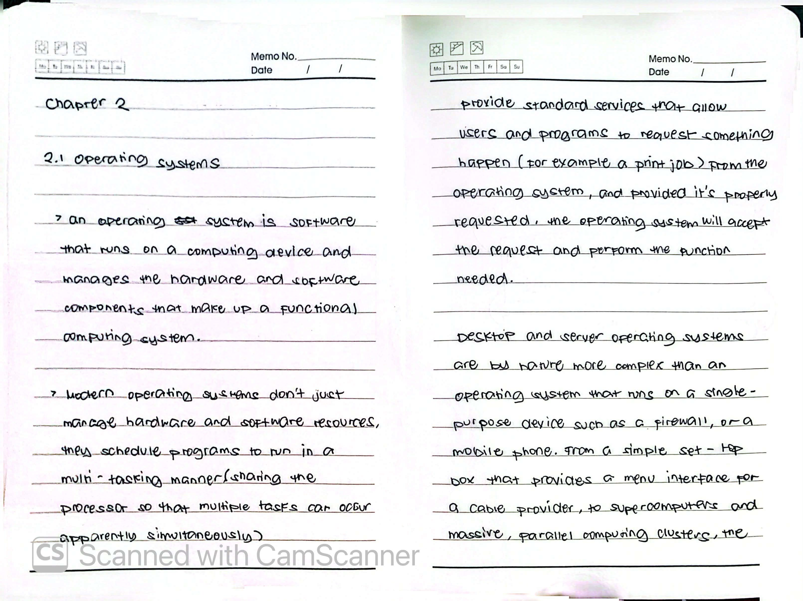

### Image 2: Operating Systems (Part 2)
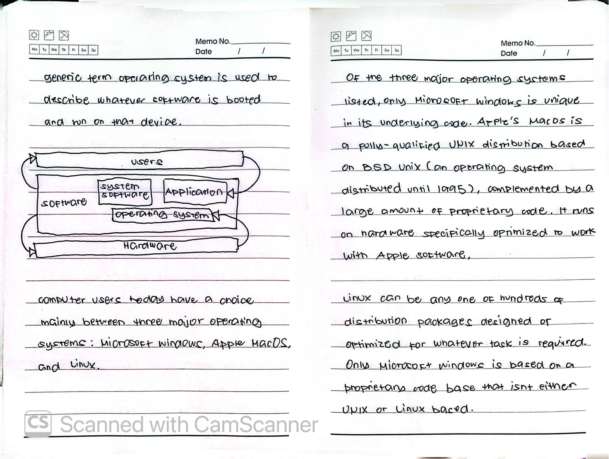

### Image 3: Operating Systems (Part 3)
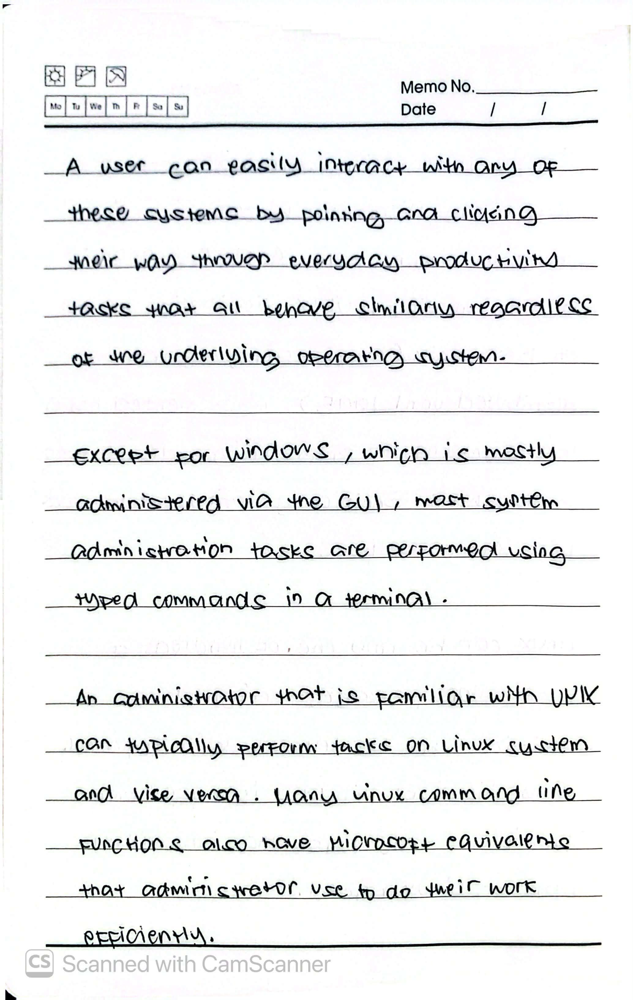

### Image 4: Decision Points - Role & Function
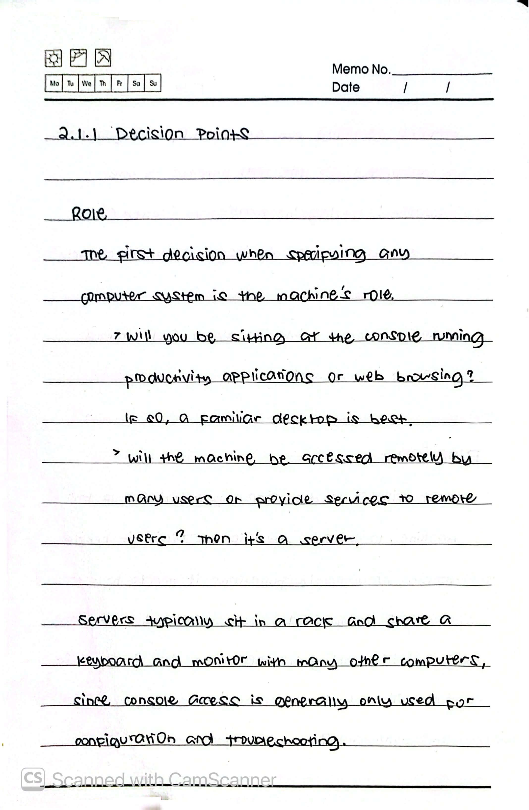

### Image 5: Decision Points - Life Cycle & Upgrades
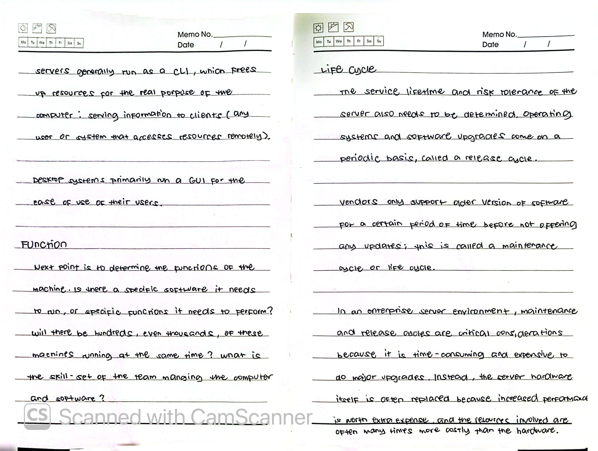

### Image 6: Decision Points - Virtualization & Cloud
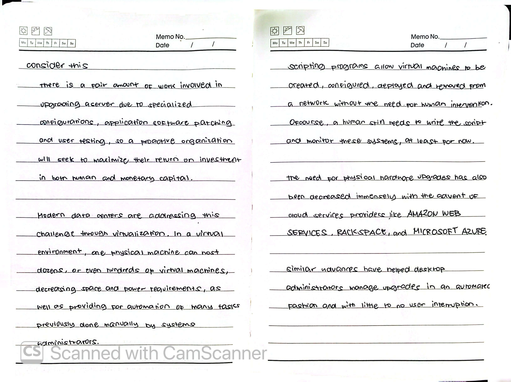

### Image 7: Stability & Compatibility
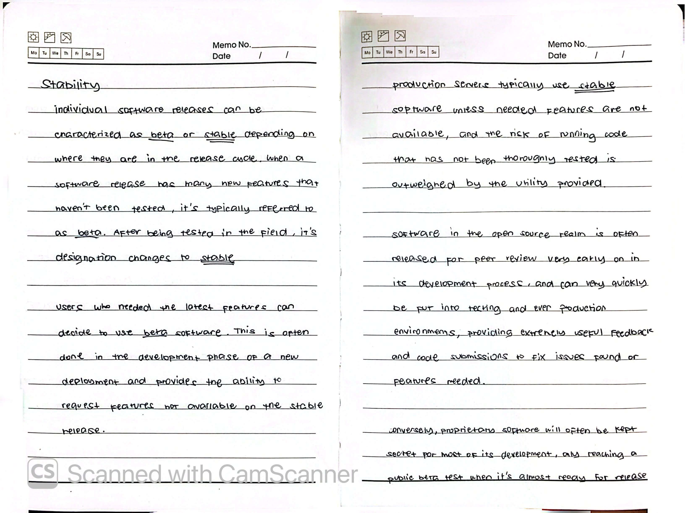

### Image 8: Compatibility & Cost
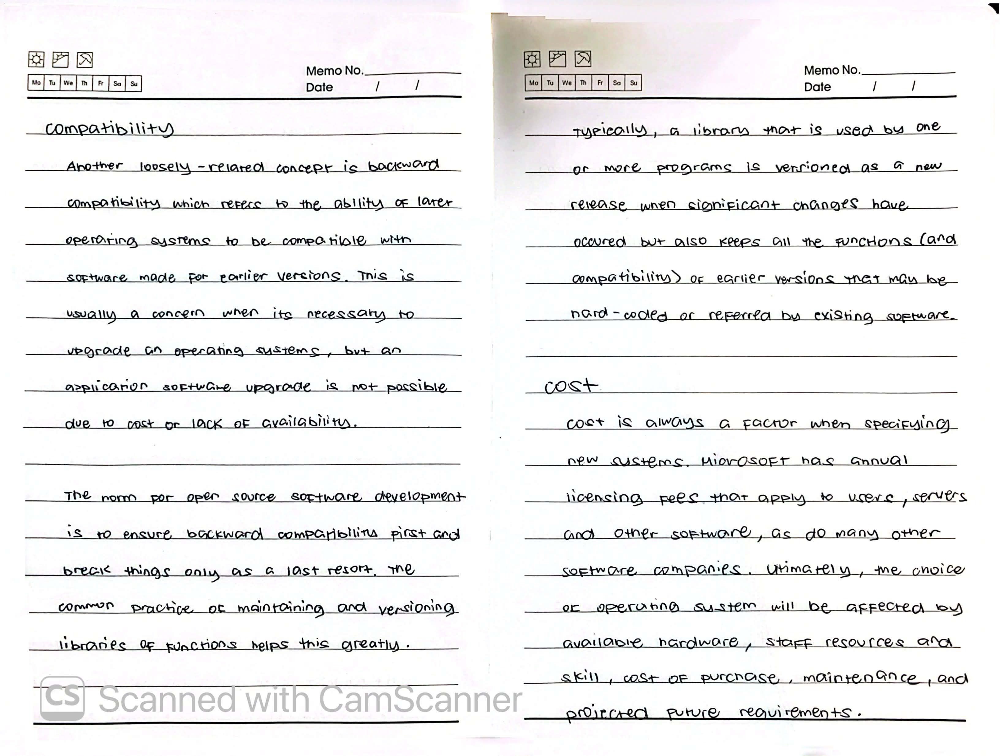

### Image 9: Interface & GUI History
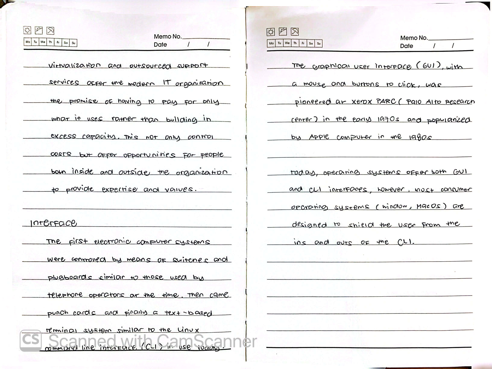

### Image 10: Microsoft Windows
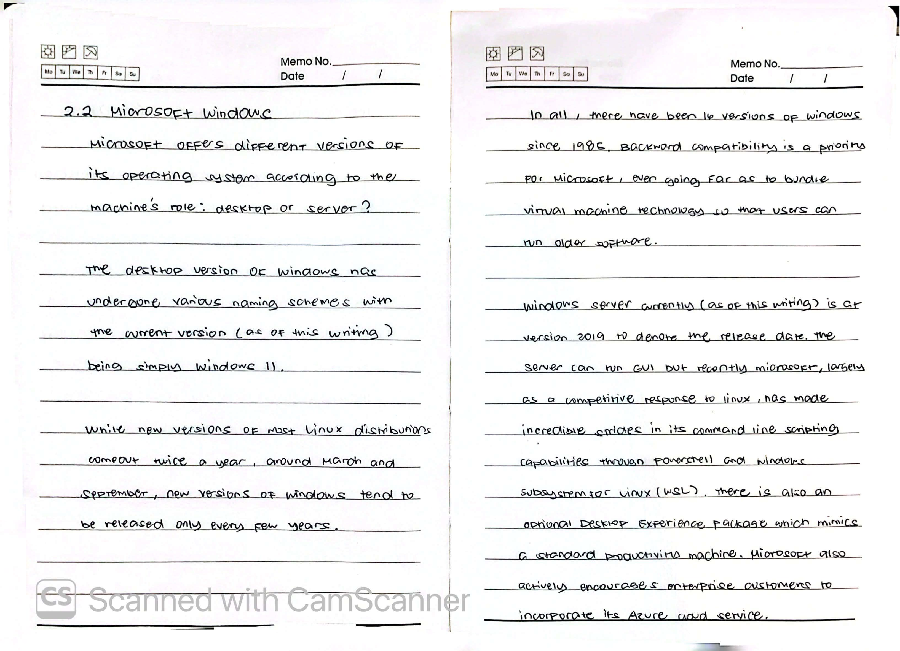

### Image 11: Apple MacOS
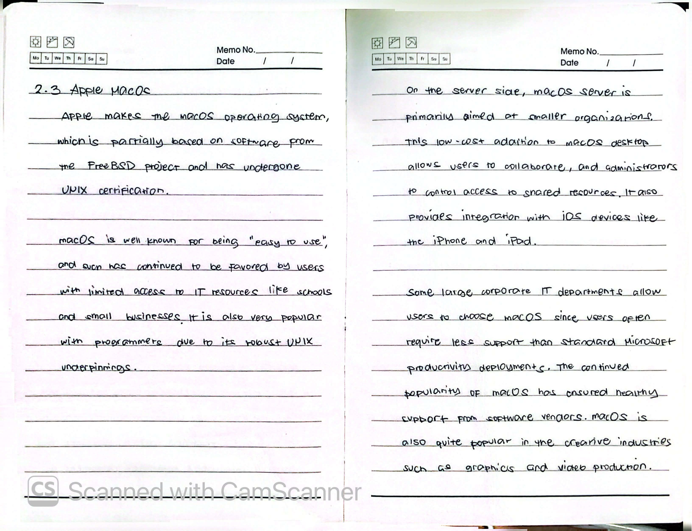

### Image 12: macOS Users & Linux Distributions
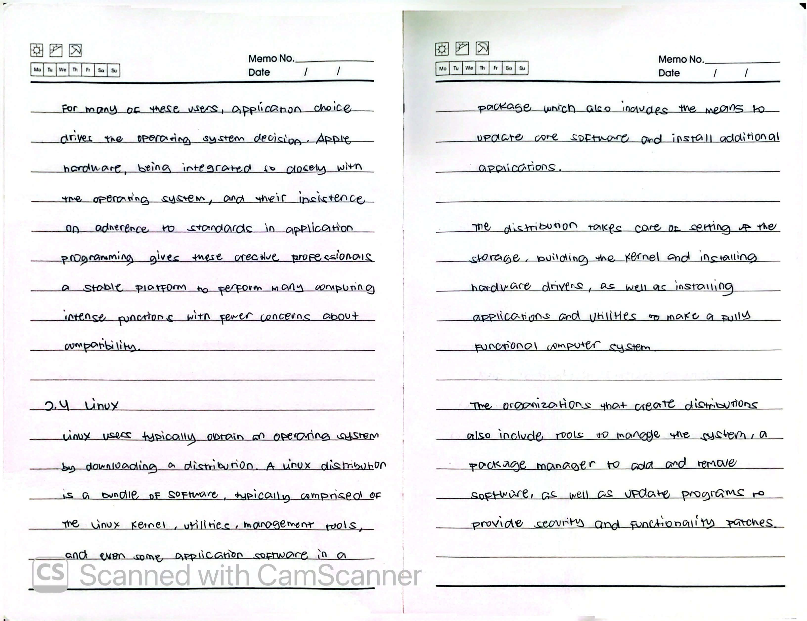

### Image 13: Linux Distributions & Role
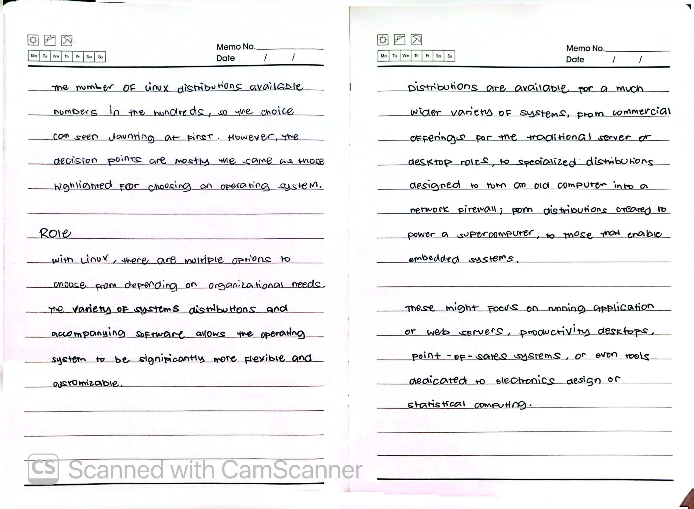

---

## 🆕 Ongoing Learning & Additions

### New Discoveries / Lab Reflections

### Command Cheat Sheet (Module 02)
| Command | Description | Example |
| :--- | :--- | :--- |
| `uname -r` | Show Linux kernel version | `uname -r` |
| `su` | Switch user (to root) | `su` |
| `ls` | List directory contents | `ls -la` |

---

## 📚 Resources
- [LPI Linux Essentials Official Page](https://www.lpi.org/our-certifications/linux-essentials-overview/)
- [GNU Project Official Website](https://www.gnu.org/)
- [The Linux Kernel Archives](https://www.kernel.org/)