# Module 02: Operating Systems

> **Course:** NDG Linux Essentials  
> **Status:** ✅ Complete  
> **Objective:** Understand the role of operating systems, different interface types, and major OS families.

---

## 📖 Chapter 2: Operating Systems

### 2.1 Operating Systems
- an operating system is software that runs on a computing device and manages the hardware and software components that make up a functional computing system.
- Modern operating systems don't just manage hardware and software resources, they schedule programs to run in a multi-tasking manner (sharing the processor so that multiple tasks can occur apparently simultaneously)
- provide standard services that allow users and programs to request something happen (for example a print job) from the operating system, and provided it's properly requested, the operating system will accept the request and perform the function needed.
- Desktop and server operating systems are by nature more complex than an operating system that runs on a single-purpose device such as a firewall, or a mobile phone. From a simple set-top box that provides a menu interface for a cable provider, to supercomputers and massive, parallel computing clusters, the generic term operating system is used to describe whatever software is booted and run on that device.

> **Diagram:**
> users
> software (system software, application, operating system)
> hardware

- Computer users today have a choice mainly between three major operating systems: Microsoft Windows, Apple MacOS, and Linux.
- Of the three major operating systems listed, only Microsoft windows is unique in its underlying code. Apple's MacOS is a fully-qualified UNIX distribution based on BSD Unix (an operating system distributed until 1995), complemented by a large amount of proprietary code. It runs on hardware specifically optimized to work with Apple software.
- Linux can be any one of hundreds of distribution packages designed or optimized for whatever task is required. Only Microsoft windows is based on a proprietary code base that isn't either UNIX or Linux based.
- A user can easily interact with any of these systems by pointing and clicking their way through everyday productivity tasks that all behave similarly regardless of the underlying operating system.
- Except for windows, which is mostly administered via the GUI, most system administration tasks are performed using typed commands in a terminal.
- An administrator that is familiar with UNIX can typically perform tasks on Linux system and vise versa. Many UNIX command line functions also have Microsoft equivalents that administrator use to do their work efficiently.

### 2.1.1 Decision Points

#### Role
- The first decision when specifying any computer system is the machine's role.
  - Will you be sitting at the console running productivity applications or web browsing? If so, a familiar desktop is best.
  - Will the machine be accessed remotely by many users or provide services to remote users? Then it's a server.
- Servers typically sit in a rack and share a keyboard and monitor with many other computers, since console access is generally only used for configuration and troubleshooting.
- servers generally run as a CLI, which frees up resources for the real purpose of the computer: serving information to clients (any user or system that accesses resources remotely).
- Desktop systems primarily run a GUI for the ease of use of their users.

#### Function
- Next point is to determine the functions of the machine. Is there a specific software it needs to run, or specific functions it needs to perform? Will there be hundreds, even thousands, of these machines running at the same time? What is the skill-set of the team managing the computer and software?
- Commercial and large enterprises may also limit their choices to distributions that offer commercial support because paying for another tier of support may be better than risking extensive outages.
- For the most part, concerns over security have been addressed through the large open source community, which monitors kernel changes for vulnerabilities and provides bug reporting and fixes at a much larger scale than closed source vendors can achieve.
- Support for Necessary applications may vary and is, therefore, an additional consideration. Open application vendors choose a subset of distributions to support.
- Different distributions have different versions of key libraries, and it is difficult for a company to support all these different versions. However, some applications like Firefox and LibreOffice are widely supported and available for all major distributions.

#### life cycle
- the service lifetime and risk tolerance of the server also needs to be determined. Operating systems and software upgrades come on a periodic basis, called a release cycle.
- vendors only support older version of software for a certain period of time before not offering any updates; this is called a maintenance cycle or life cycle.
- In an enterprise server environment, maintenance and release cycles are critical considerations because it is time-consuming and expensive to do major upgrades. Instead, the server hardware itself is often replaced because increased performance is worth extra expense and the resources involved are often many times more costly than the hardware.

> **consider this**
> there is a fair amount of work involved in upgrading a server due to specialized configurations, application software patching, and user testing, so a proactive organization will seek to maximize their return on investment in both human and monetary capital.

- Modern data centers are addressing this challenge through virtualization. In a virtual environment, one physical machine can host dozens, or even hundreds of virtual machines, decreasing space and power requirements, as well as providing for automation of many tasks previously done manually by systems administrators.
- scripting programs allow virtual machines to be created, configured, deployed and removed from a network without the need for human intervention. Of course, a human still needs to write the script and monitor these systems, at least for now.
- the need for physical hardware upgrades has also been decreased immensely with the advent of cloud services providers like AMAZON WEB SERVICES, RACKSPACE, and MICROSOFT AZURE.
- Similar advances have helped desktop administrators manage upgrades in an automatic fashion and with little to no user interruption.
- Most distributions have both major and minor update updates to introduce new features and fix bugs, existing bugs. Additionally, there are development packages where users can contribute code and submit patches for possible inclusion into new releases.
- Linux distributions can be broadly classified in two main categories: enthusiasts and enterprise. An enthusiasts distribution such as openSUSE's tumbleweed has a fast update cycle, is not supported for enterprise and was not maintain (or drop) features or software in the next version that are in the current one.
- Red Hat's Fedora project uses a similar method of development and release cycle, as does Ubuntu's desktop.
- Enterprise distributions are almost the exact opposite, in that they take care to be stable and consistent, and offer enterprise-grade support for extended periods, anywhere from 5-13 years in the case of SUSE. Enterprise distributions are power by for, being offered mainly by Red Hat, Canonical and SUSE.

#### Stability
- individual software releases can be characterized as beta or stable depending on where they are in the release cycle. when a software release has many new features that haven't been tested, it's typically referred to as beta. After being tested in the field, it's designation changes to stable.
- users who need the latest features can decide to use beta software. This is often done in the development phase of a new development and provides the ability to request features not available on the stable release.
- production servers typically use stable software unless needed features are not available, and the risk of running code that has not been thoroughly tested is outweighed by the utility provided.
- software in the open source realm is often released for peer review very early on in its development process, and can very quickly be put into testing and even production environments, providing extremely useful feedback and code submissions to fix issues found or features needed.
- Conversely, proprietary software will often be kept secret for most of its development, only reaching a public beta test when it's almost ready for release.
- Application software may be written such that it only supports a specific release of a distribution, requiring users to remain on an older, less secure operating system than they might like. Therefore, some Linux releases are considered to have a long term support (LTS) of 5 years or more while others are only supported for two(2) years or less.
- Some distributions offer stable, testing and unstable releases. When choosing an unstable release for required features, consideration must be given to the fact that those features may change or disappear during the development cycle.
- Linux features have been integrated into the system for a long time, with most of the bugs and issues addressed, the software moves through testing into the stable release.
- Other releases depend on beta distributions. For instance, the Fedora distribution releases beta on pre-release of its software ahead of the full release to minimize bugs. Fedora is often considered the community-oriented beta release of Red Hat. Features are added and changed in the Fedora release before finding their way into the enterprise-ready RedHat distribution.

#### Compatibility
- Another loosely-related concept is backward compatibility which refers to the ability of later operating systems to be compatible with software made for earlier versions. This is usually a concern when its necessary to upgrade an operating system, but an application software upgrade is not possible due to cost or lack of availability.
- The norm for open source software development is to ensure backward compatibility first and break things only as a last resort. the common practice of maintaining and versioning libraries of functions helps this greatly.
- Typically, a library that is used by one or more programs is versioned as a new release when significant changes have occurred but also keeps all the functions (and compatibility) of earlier versions that may be hard-coded or referred by existing software.

#### Cost
- cost is always a factor when specifying new systems. Microsoft has annual licensing fees that apply to users, servers and other software, as do many other software companies. Ultimately, the choice of operating system will be affected by available hardware, staff resources and skill, cost of purchase, maintenance, and projected future requirements.
- virtualization and outsourced support services offer the modern IT organization the promise of having to pay for only what it uses rather than building in excess capacity. This not only control costs but offer opportunities for people both inside and outside the organization to provide expertise and values.

#### Interface
- The first electronic computer systems were controlled by means of switches and plugboards similar to those used by telephone operators at the time. then came punch cards and finally a text-based terminal system similar to the Linux command line interface (CLI) in use today.
- The graphical user interface (GUI), with a mouse and buttons to click, was pioneered at Xerox PARC (Palo Alto Research Center) in the early 1970s and popularized by Apple computer in the 1980s.
- Today, operating systems offer both GUI and CLI interfaces, however, most consumer operating systems (window, MacOS) are designed to shield the user from the ins and outs of the CLI.
- like most operating systems, linux can be used in one of two ways: graphical (GUI) and non-graphical (CLI)
- in graphical mode, users can have several different windows with terminal applications (shells) open, which is very helpful when performing tasks on multiple remote computers. Administrators and users can log-in with their username and password through a graphical interface.
- the second type of interface, the CLI, is a text-based interface to the computer, where the user types in a command and the computer then executes it.
- the CLI environment is provided by an application on the computer known as a Terminal. the terminal accepts what the user types and passes to a Shell.
- the shell interprets what the user has typed into instructions that can be executed by the operating system. If output is produced by the command, then this text is displayed in the terminal. If problems with the command are encountered, then an error message is displayed.
- the CLI starts with a text-based login. In a successful login, after being prompted for a username and password, you are taken to a CLI shell customized for the particular user.
- In CLI mode there are no windows to move around. Text editors, web browsers, and email clients are all presented in text format only. This is how UNIX operated before graphical environments were the norm. Most servers run in this mode too, since people don't log into them directly, making graphical interface a waste of resources.
- During login there may be some text displayed called the Message of the Day (MOTD). this is an opportunity for the system administrator to pass information to users, or just make a silly joke.
- Following the MOTD is the command prompt, where you can enter commands for the computer to execute.
- As new commands are entered and processed, the window scrolls up and older text is lost across the top. the terminal itself is responsible for keeping any history, such as to allow the user to scroll up and see previously entered commands.
- As far as Linux is concerned, what is on the screen is all that there is. There's nothing to move around.

### 2.2 Microsoft Windows
- Microsoft offers different versions of its operating system according to the machine's role: desktop or server?
- The desktop version of windows has undergone various naming schemes with the current version (as of this writing) being simply windows 11.
- While new versions of most Linux distributions comeout twice a year, around March and September, new versions of windows tend to be released only every few years.
- In all, there have been 16 versions of windows since 1985. backward compatibility is a priority for Microsoft, even going far as to bundle virtual machine technology so that users can run older software.
- windows server currently (as of this writing) is at version 2019 to denote the release date. the server can run GUI but recently microsoft, largely as a competitive response to linux, has made incredible strides in its command line scripting capabilities through Powershell and Windows Subsystem for Linux (WSL). there is also an optional Desktop Experience package which mimics a standard productivity machine. Microsoft also actively encourages enterprise customers to incorporate its Azure cloud service.

### 2.3 Apple MacOS
- Apple makes the macOS operating system, which is partially based on software from the FreeBSD project and has undergone UNIX certification.
- macOS is well known for being "easy to use", and such has continued to be favored by users with limited access to IT resources like schools and small businesses. It is also very popular with programmers due to its robust UNIX underpinnings.
- On the server side, macOS server is primarily aimed at smaller organizations. This low-cost addition to macOS desktop allows users to collaborate, and administrators to control access to shared resources. It also provides integration with iOS devices like the iPhone and iPod.
- Some large corporate IT departments allow users to choose macOS since users often require less support than standard Microsoft productivity deployments. The continued popularity of macOS has ensured healthy support from software vendors. macOS is also quite popular in the creative industries such as graphics and video production.
- For many of these users, application choice drives the operating system decision. Apple hardware, being integrated so closely with the operating system, and their insistence on adherence to standards in application programming gives these creative professionals a stable platform to perform many computing intense functions with fewer concerns about compatibility.

### 2.4 Linux
- Linux users typically obtain an operating system by downloading a distribution. A Linux distribution is a bundle of software, typically comprised of the Linux kernel, utilities, management tools, and even some application software in a package which also includes the means to update core software and install additional applications.
- The distribution takes care of setting up the storage, building the kernel and installing hardware drivers, as well as installing applications and utilities to make a fully functional computer system.
- The organizations that create distributions also include tools to manage the system, a package manager to add and remove software, as well as update programs to provide security and functionality patches.
- The number of Linux distributions available numbers in the hundreds, so the choice can seem daunting at first. However, the decision points are mostly the same as those highlighted for choosing an operating system.

#### Role
- With Linux, there are multiple options to choose from depending on organizational needs. The variety of systems distributions and accompanying software allows the operating system to be significantly more flexible and customizable.
- Distributions are available for a much wider variety of systems, from commercial offerings for the traditional server or desktop roles, to specialized distributions designed to turn an old computer into a network firewall, from distributions created to power a supercomputer, to those that enable embedded systems.
- These might focus on running application or web servers, productivity desktops, point-of-sale systems, or even tools dedicated to electronics design or statistical computing.

> **Consider this:**
> openSUSE and its enterprise counterpart, SUSE Linux Enterprise Server (SLES) are similar, in that the community edition is used as a testing ground for the features and functions that will eventually be migrated into the enterprise version.
> Previously, some/most distribution, later versions of the openSUSE and SLES distribution codebases are nearly identical, allowing for easier assimilation of features and code from one to the other.

#### Consider This
- The Debian distribution warns users about the pitfalls of using the "sid" (unstable) release with the following warning:
> "sid" is subject to massive changes and in-place library updates. This can result in a very "unstable" system which contains packages that cannot be installed due to missing libraries, dependencies that cannot be fulfilled, etc. Use it at your own risk!
- your chosen Linux distribution itself might be zero cost, but paying for support may be worthwhile depending on organizational needs and capabilities.

#### 2.4.1 Linux Distributions

##### Red Hat
- Red Hat started as a simple distribution that introduced Red Hat Package Manager (RPM). the developer eventually formed a company around it, which tried to commercialize a Linux desktop for business.
- Over time, Red Hat started to focus more on the server applications, such as web- and file- serving and released Red Hat Enterprise Linux (RHEL), which was a paid service on a long release cycle. the release cycle dictates how often software is upgraded.
- A business may value stability and want long release cycles, while a hobbyist or a startup may want the latest software and opt for a shorter release cycle. To satisfy the latter group, Red Hat sponsors the Fedora Project which makes a personal desktop comprising the latest software but is still built on the same foundations as the enterprise version.
- Because everything in Red Hat Enterprise Linux is opensource, a project called CentOS came to be. It recompiled all the RHEL packages (converting their source code from the programming language they were written into language usable by the system) and gave them away for free.
- CentOS and others like it (such as Scientific Linux) are largely compatible with RHEL and integrate some newer software, but do not offer the paid support that Red Hat does.
- Scientific Linux is an example of a specific-use distribution based on Red Hat. the project is a Fermilab-sponsored distribution designed to enable scientific computing.
- Among its many applications, Scientific Linux is used with particle accelerators including the Large Hadron Collider at CERN.

##### SUSE
- originally derived from Slackware, was one of the first comprehensive Linux distributions, it has many similarities to Red Hat Enterprise Linux.
- the original company was purchased by Novell in 2003, which was the purchased by The Attachmate Group in 2011. The Attachmate group then merged with Micro Focus International in 2014, and in 2018 SUSE announced plans to go forward as an independent business. through an of the mergers and acquisitions, SUSE has managed to continue and grow.
- while SUSE Linux Enterprise contains proprietary code and is sold as a server product, openSUSE is a completely open, free version with multiple desktop packages similar to CentOS and Linux Mint.

##### Debian
- Debian is more of a community effort, and as such, also promotes the use of open source software and adherence to standards.
- Debian came up with its own package management system based on the .deb file format while Red Hat leaves non-Intel and AMD platform support to derivative projects, Debian supports many of these platforms directly.
- Ubuntu is the most popular Debian-derived distribution. It is the creation of Canonical, a company that was made to further the growth of Ubuntu and makes money by providing support. Ubuntu has several different variants for desktop, server and various specialized applications. They also offer an LTS version that is kept up to date for 3 years on desktops and 5 years on servers, which gives developers and the companies they work for confidence to build solutions based on a stable distribution.
- Linux Mint was started as a fork of Ubuntu Linux, while still relying upon the Ubuntu repositories.
- there are various versions, all free of cost, but some include propriety codecs, which cannot be distributed without license restrictions in certain countries.

##### Android
- Android (central controller of everything that happens on computer)
- Linux is a kernel, and many of the commands covered in this course are actually part of the GNU package. that is why some people insist on using the package term GNU/Linux instead of Linux alone.
- Android, sponsored by Google, is the world's most popular Linux distribution. It is fundamentally different from its counterparts.
- Android uses the Dalvik virtual machine with Linux, providing a robust platform for mobile devices such as phones and tablets. However, lacking the traditional packages that are often distributed with Linux (such as GNU and Xorg), Android is generally incompatible with desktop Linux distributions.
- This incompatibility means that a Red Hat or Ubuntu user cannot download software from the Google Play Store. Likewise, a terminal emulator in Android lacks many of the commands of its Linux counterparts. It is possible, however, to use BusyBox with Android to enable most commands to work.

##### Other
- Raspbian is a specialized Linux distribution optimized to run on Raspberry Pi hardware. This combination has seen significant use in training for programmers and hardware designers at all levels. Its low cost and ease of use have made it a favorite of educators worldwide, and many add-on devices are available to extend its capabilities into the physical world.
- There is a multitude of labs and projects available that teach everything from environmental monitoring to circuit design, machine learning, and robotics.
- Linux from Scratch (LFS) is more of a learning tool than a working distribution. This project consists of an online book, and source code, with 'step-by-step instructions' for building a custom Linux distribution from the source code up. This 'distribution' embodies the true spirit of Linux whereby users can modify any aspect of the operating system and learn how all the pieces work together. It's also good starting point for anyone else who needs specialized functionality or an ultra-compact build for an embedded system.
- "Be aware that there are hundreds, if not thousands more Linux distributions that are available. While there are many different distributions of Linux, many of the programs and commands remain the same or very similar."

### 2.4.2 Embedded Systems
- Linux started out as something that would only run on a computer like linus torvald's: an intel 386 PC with a specific hard drive controller, but since anyone could add to or change Linux, people started building support for other hardware.
- Eventually, Linux started supporting other chips with an emphasis on small size and low power consumption.
- Because of this flexibility, a significant number of device makers have used linux as the operating system for their hardware products.
- Today we call these embedded systems because they are designed to do a specific task on hardware optimized for only that purpose. these systems encompass a tremendous diversity of devices that are used today, from cell phones to smart TVs and appliances, to remote monitoring systems for pipelines and factories.
- As linux evolved, specialized processor chips were developed for consumer and industrial devices to take advantage of its capabilities. support for linux has become so ubiquitous that it is possible to prototype and bring to market new devices using off-the-shelf components.
- the rise of cheap, small, adaptable single-board computers like the Raspberry Pi has given experimenters and entrepreneurs everywhere tools to quickly build custom solutions, powered by linux, that would have taken months of work by specialized teams just a few years ago.
- while consumers are familiar with embedded linux entertainment devices like digital video recorders (DVRs) and "smart TVs", the real impact of embedded system, linux is just starting to be realized. the internet of things (IoT) is just a ramping up with cheap, ubiquitous devices being deployed on everything from oil wells to solar generating farms.
- these networks of smart sensors and controllers enable engineers to adjust critical processes in real time while monitoring and reporting back to central control stations. as more processes are being monitored and more data is being integrated with machine learning and artificial intelligence (AI) we can anticipate gains in efficiency, safety and productivity only dreamed of by past generations.

---

## 🏆 Chapter 02 Exam Results

**Score:** 100% (10/10 Correct)  
**Date:** September 25, 2026

| Question | Answer | Section |
| :--- | :--- | :---: |
| Embedded Systems means: | Systems designed to do a specific task on hardware optimized for only that purpose | 2.4.2 |
| In Linux, RPM can be defined as: | The Package Manager program for Red Hat Linux | 2.4.1 |
| SUSE is derived from which distribution? | Slackware | 2.4.1 |
| IoT is one application of embedded systems: | True | 2.4.2 |
| The Raspberry Pi is popular with experimenters because: | It's cheap and adaptable | 2.4.1 |
| The release cycle: | Dictates how often software is updated | 2.4.1 |
| Debian is a community effort that supports many hardware platforms | True | 2.4.1 |
| The Linux platform that runs on mobile phones is called: | Android | 2.4.1 |
| Which distributions are made by, or are clones of, RedHat? | Fedora, CentOS | 2.4.1 |
| When choosing a distribution of Linux, you should consider: | If the application software is supported by the distribution, Will commercial support be required for the OS, Does your organization require long-term support for the system, Does the distribution offer a "stable" version, Will users require a GUI | 2.4 |

---

## 📸 Proof of Learning (Handwritten Notes)

### Image 1: Operating Systems (Part 1)

### Image 2: Operating Systems (Part 2)

### Image 3: Operating Systems (Part 3)

### Image 4: Decision Points - Role & Function

### Image 5: Decision Points - Life Cycle & Upgrades

### Image 6: Decision Points - Virtualization & Cloud

### Image 7: Stability & Compatibility

### Image 8: Compatibility & Cost

### Image 9: Interface & GUI History

### Image 10: Microsoft Windows

### Image 11: Apple MacOS

### Image 12: macOS Users & Linux Distributions

### Image 13: Linux Distributions & Role

### Image 14: Functions & Support
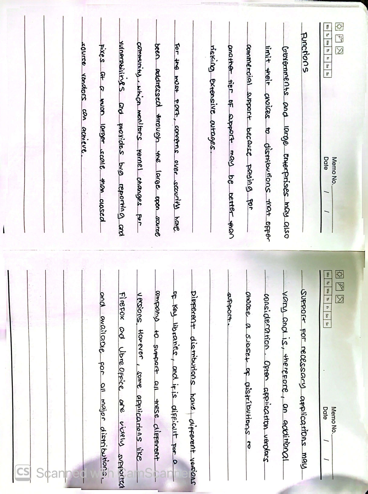

### Image 15: Life Cycle & Red Hat Fedora
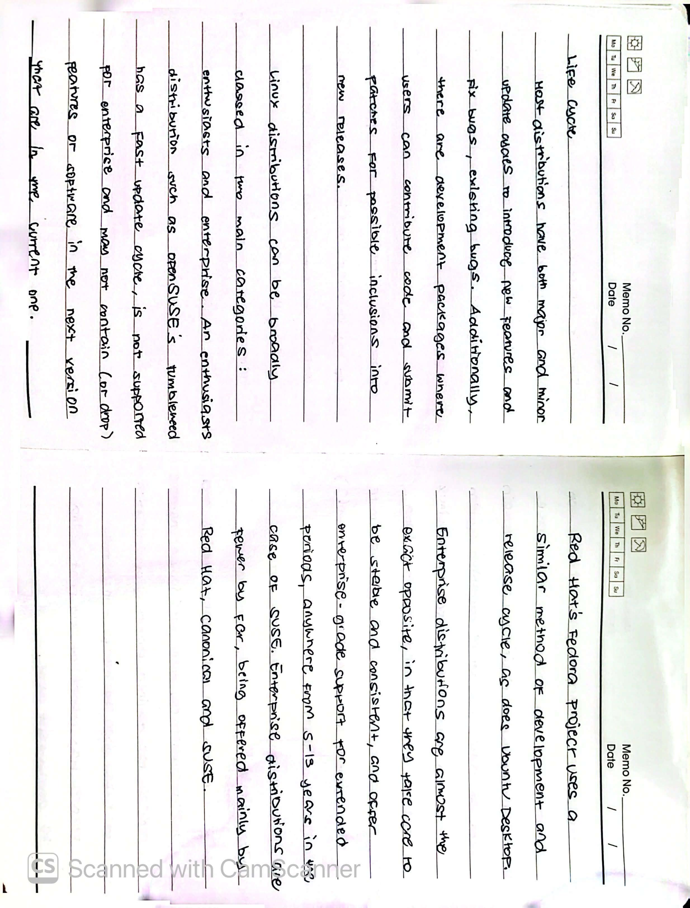

### Image 16: Stability & Application Software
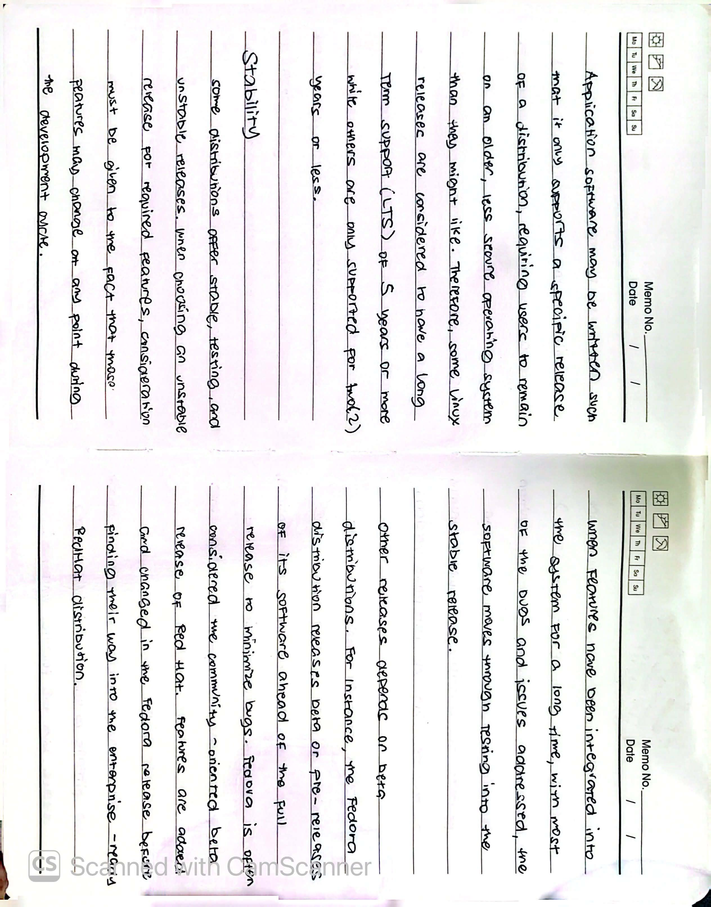

### Image 17: openSUSE, SLES & Debian sid
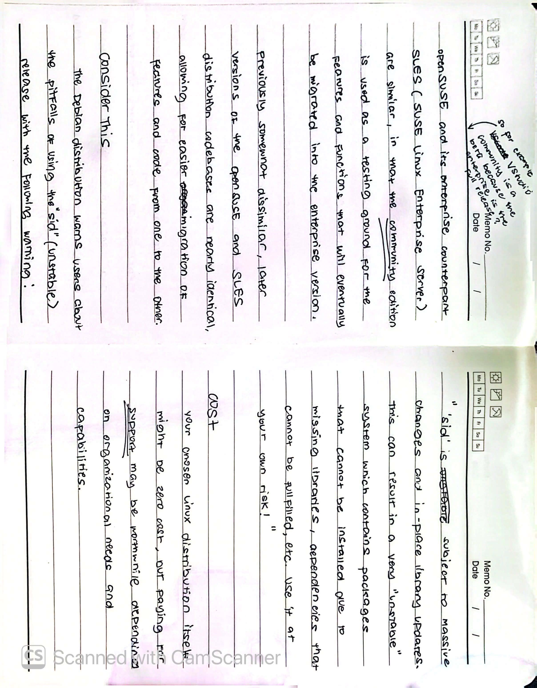

### Image 18: Interface & CLI Environment
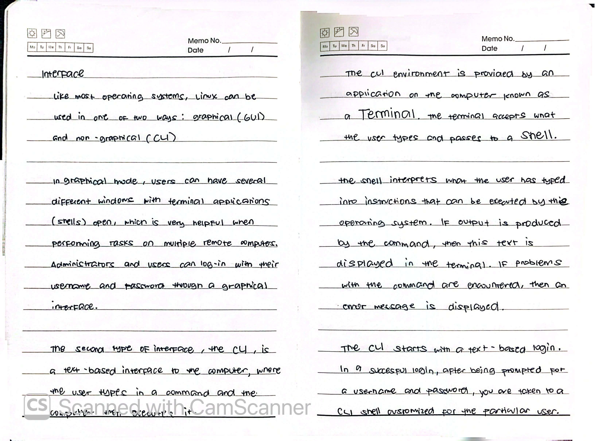

### Image 19: CLI Mode & MOTD
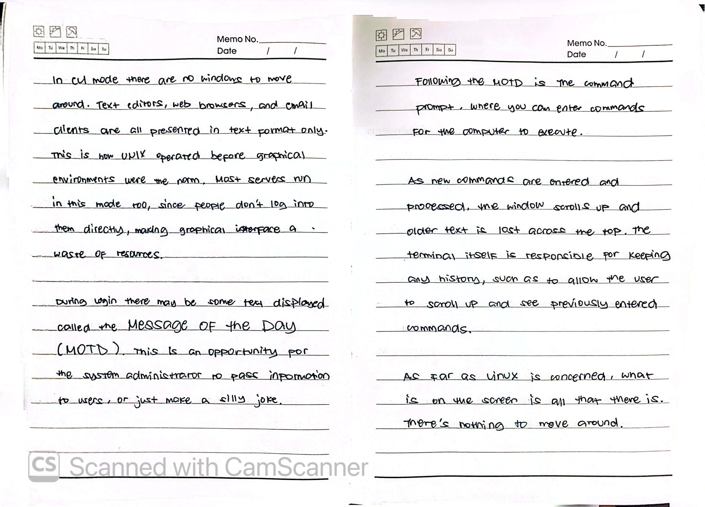

### Image 20: Red Hat & Fedora
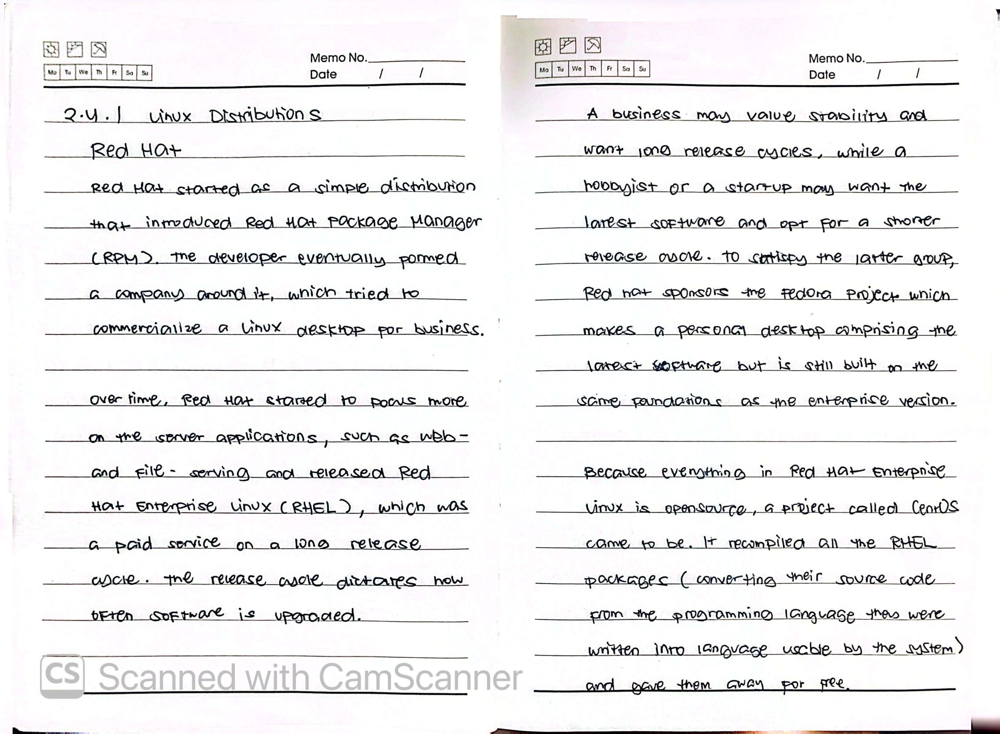

### Image 21: CentOS, Scientific Linux & SUSE
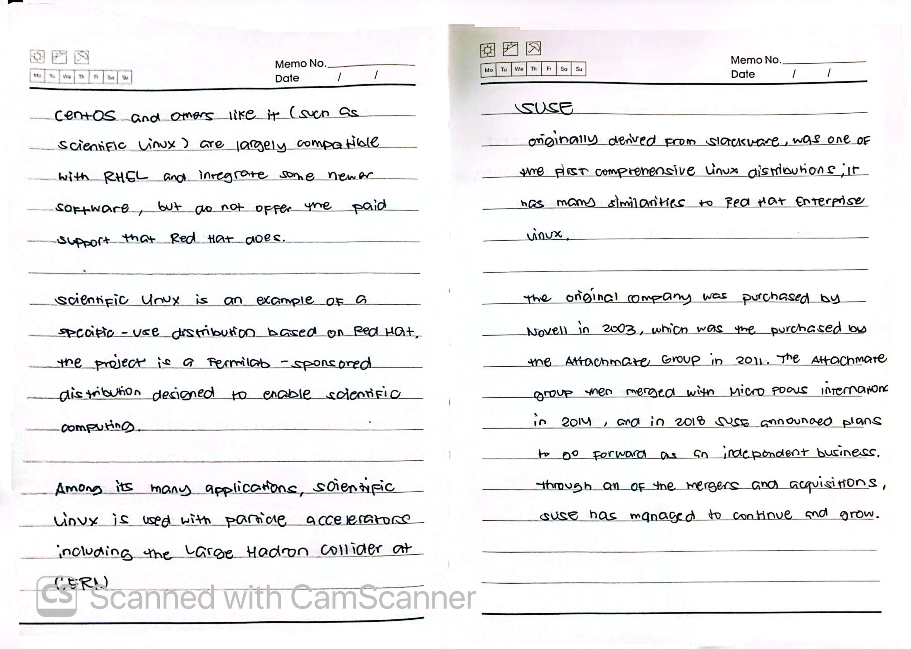

### Image 22: SUSE, Debian & Ubuntu
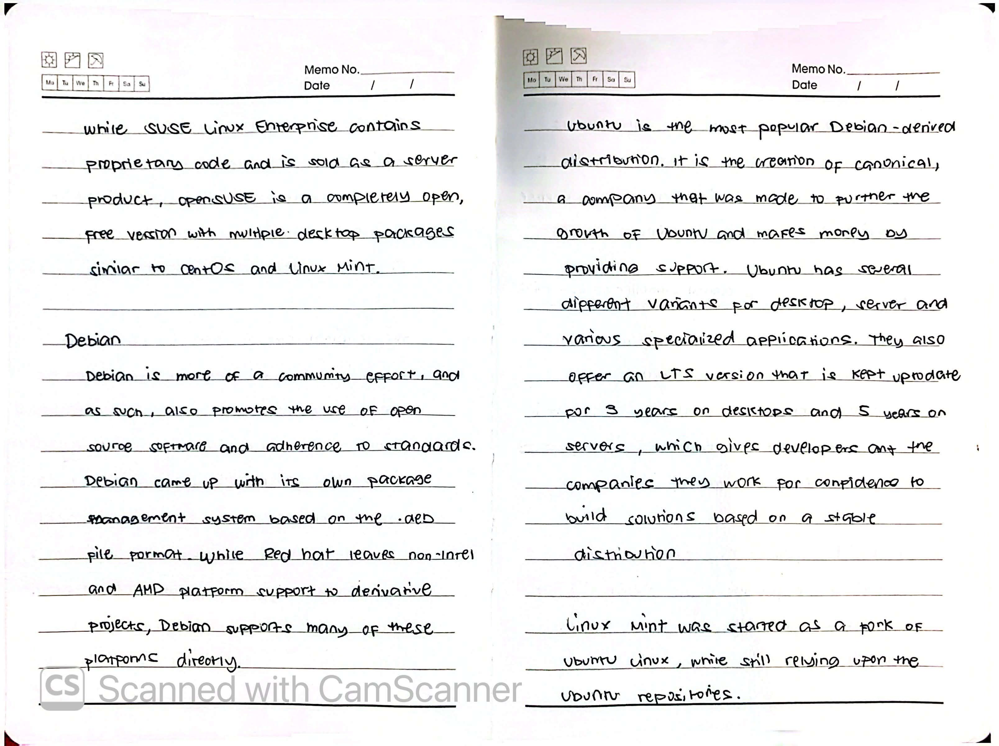

### Image 23: Android & Linux
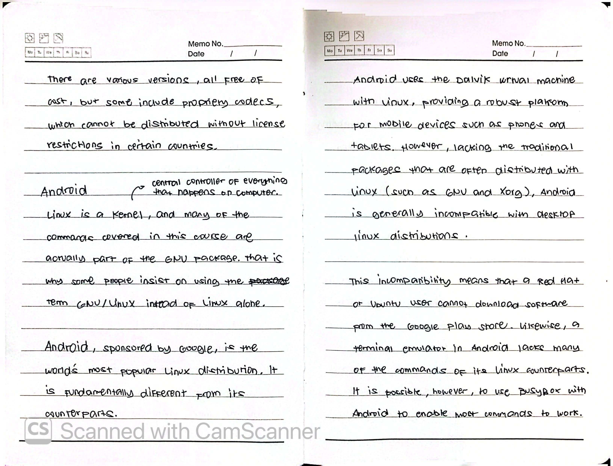

### Image 24: Raspbian & Linux from Scratch
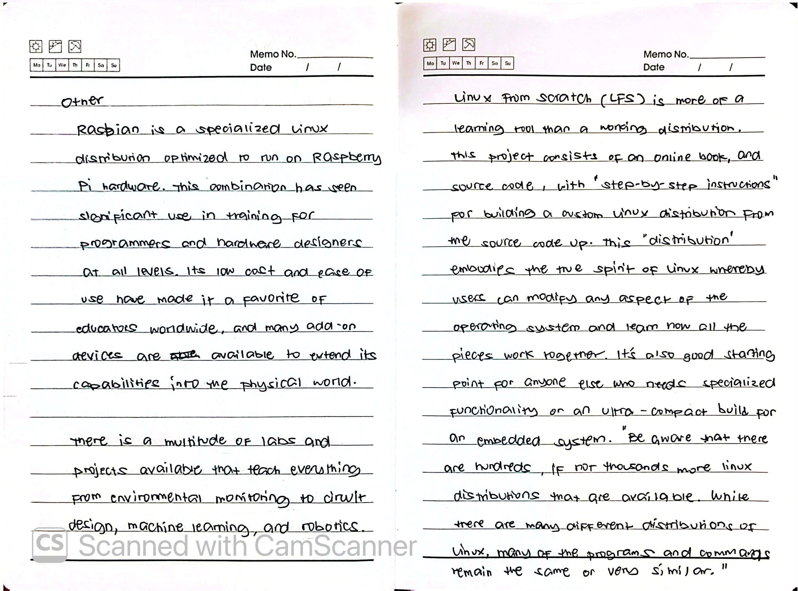

### Image 25: Embedded Systems
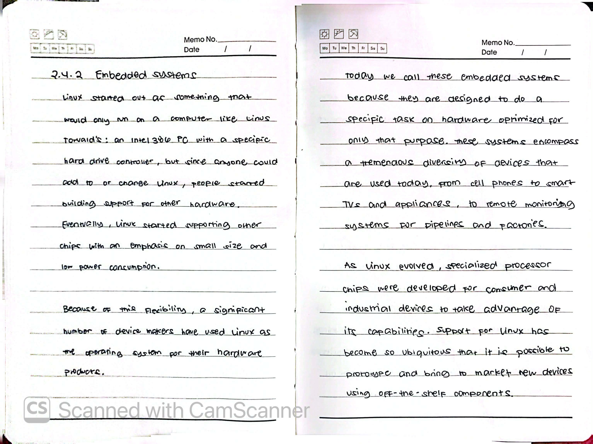

### Image 26: IoT & Embedded Linux
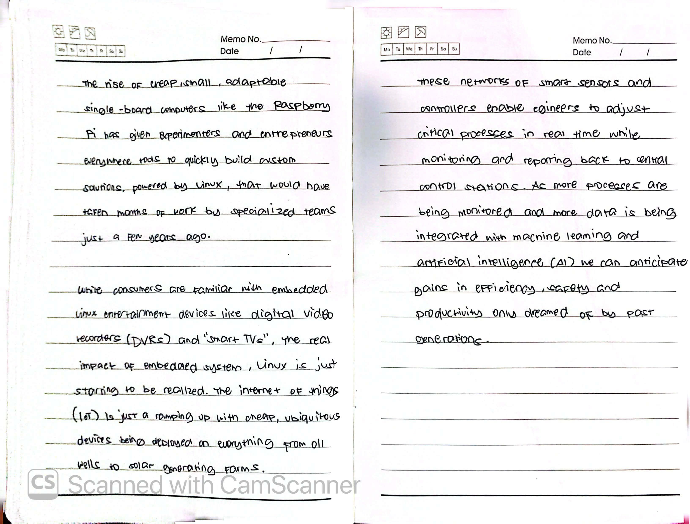

---

## 🆕 Ongoing Learning & Additions

### New Discoveries / Lab Reflections

### Command Cheat Sheet (Module 02)
| Command | Description | Example |
| :--- | :--- | :--- |
| `uname -r` | Show Linux kernel version | `uname -r` |
| `su` | Switch user (to root) | `su` |
| `ls` | List directory contents | `ls -la` |

---

## 📚 Resources
- [LPI Linux Essentials Official Page](https://www.lpi.org/our-certifications/linux-essentials-overview/)
- [GNU Project Official Website](https://www.gnu.org/)
- [The Linux Kernel Archives](https://www.kernel.org/)